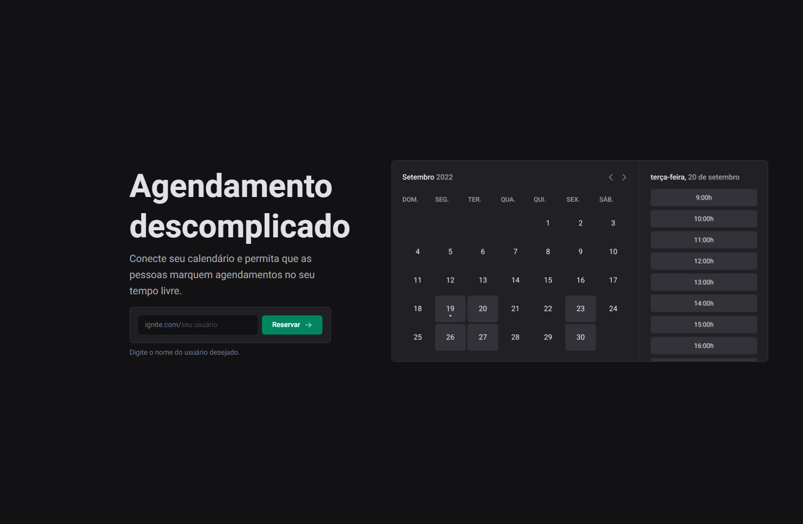

<h1 align="center">Ignite Call</h1>



#### This project is a schedule system that is connected with google calendar.

### Resource

- React hook form and Zod to handle with form and validation.
- Tanstack React query to handle with routes.
- Axios to handle with API requests.
- OAuth to handle with authentication.
- Prisma to provide database table schemas.
- Connect with google account and provide permission to use calendar.

## Features

### Authentication

- [x] it should be able to authenticate using Google account;

### Profile

- [x] it should be able to create a user name;
- [x] it should be able to config a full name;
- [x] it should be able to write about you;
- [x] it should be able to load profile photo from Google account;

### Scheduling

- [x] it should be able to set days and times that is available;
- [x] it should be able to view days and times that is available;
- [x] it should be able to check directly on Google Calendar the day and hour of scheduling;

## Run

```http
git clone https://github.com/andresilveira1/ignite-call.git

npm install
```